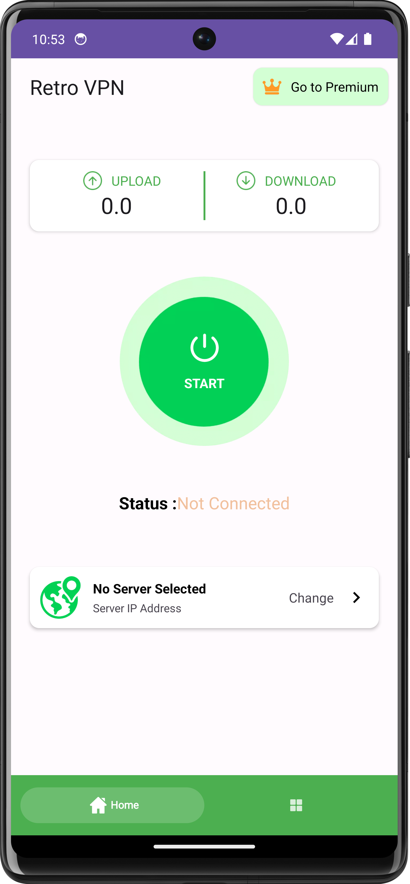
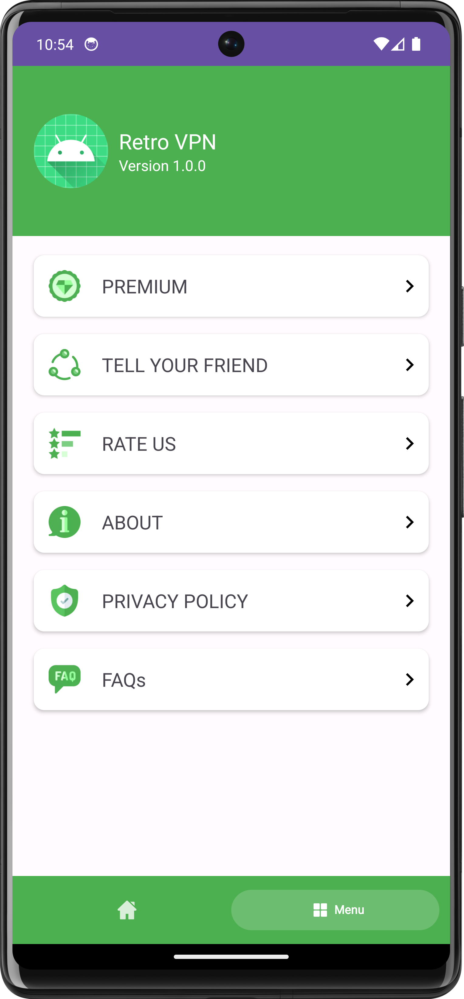
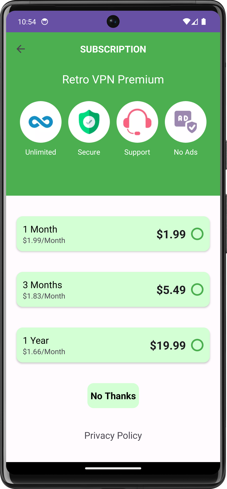
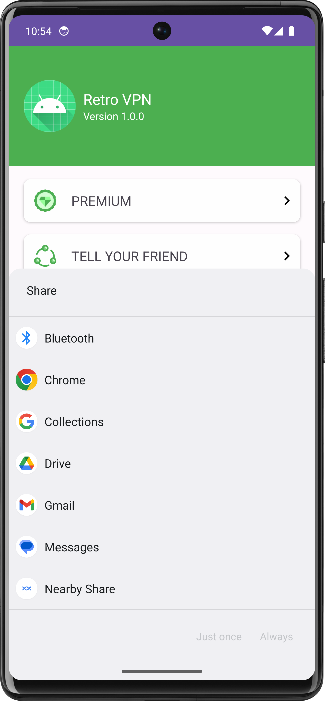
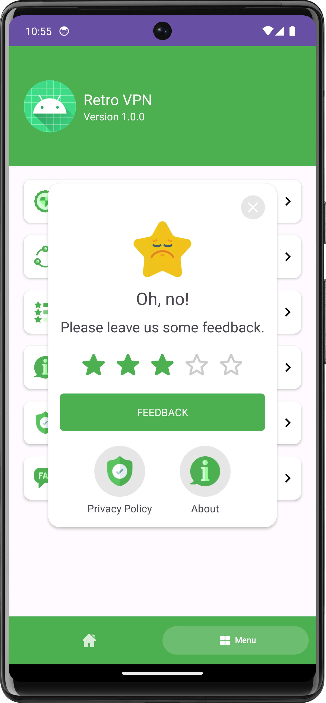
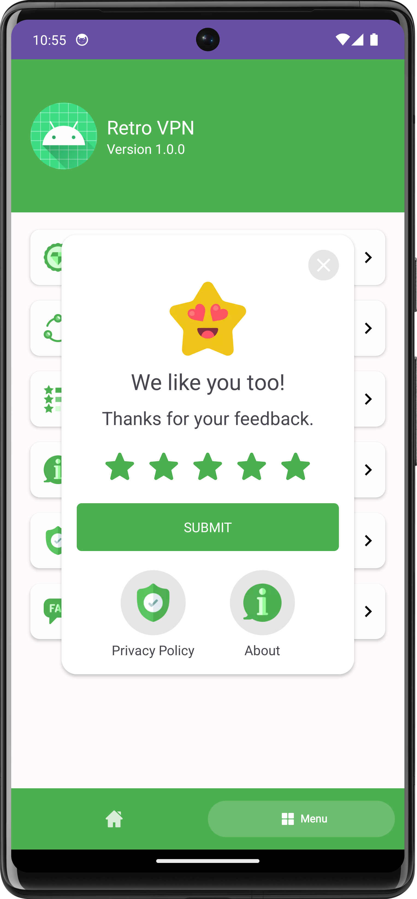
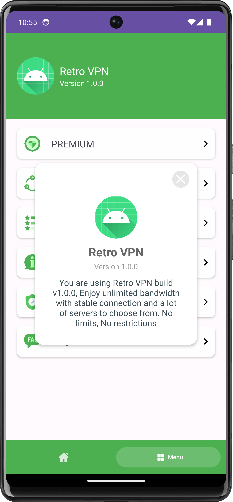
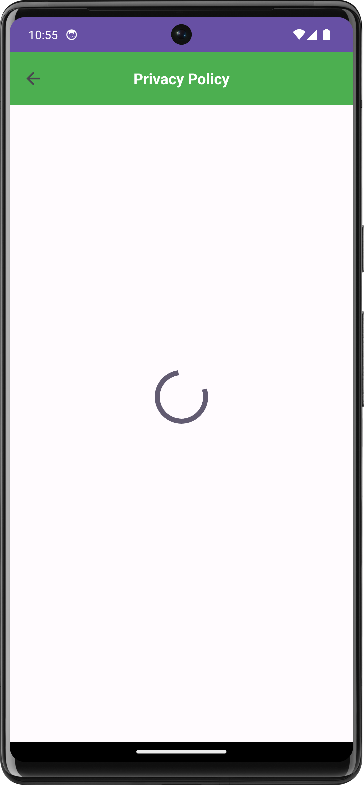

# RetroVPN

RETRO VPN is a robust and secure VPN application designed to provide users with a seamless and secure internet browsing experience. This application is built with a focus on user privacy and online security.

# Features
- Secure Connection: RETRO VPN provides a secure connection to the internet, protecting your data from potential threats and breaches.
- Privacy Protection: With RETRO VPN, your online activities are completely private. Your IP address is hidden, ensuring your browsing habits remain confidential.
- Global Server Access: RETRO VPN allows you to connect to servers worldwide. This feature enables you to access content that may be restricted in your geographical location.
- User-Friendly Interface: RETRO VPN is designed with a simple and intuitive interface, making it easy for users to connect to a VPN server.
- High-Speed Connection: Despite the high level of security, RETRO VPN does not compromise on speed. Users can enjoy a high-speed internet connection for browsing, streaming, and downloading.

<table>
  <tr>
    <td>Home Page</td>
     <td>Menu Page </td>
     <td>Subscription Page </td>
     <td>Share Details Page </td>
  </tr>
  <tr>
    <td valign="top"></td>
    <td valign="top"></td>
    <td valign="top"></td>
    <td valign="top"></td>
   
  </tr>
 </table>

 <table>
  <tr>
    <td>Feedback Page</td>
     <td>Feedback Page</td>
     <td>About Page </td>
     <td>Privacy Policy Page</td>
  </tr>
  <tr>
    <td valign="top"></td>
    <td valign="top"></td>
    <td valign="top"></td>
    <td valign="top"></td>
   
  </tr>
 </table>

# Libraries and technologies used
